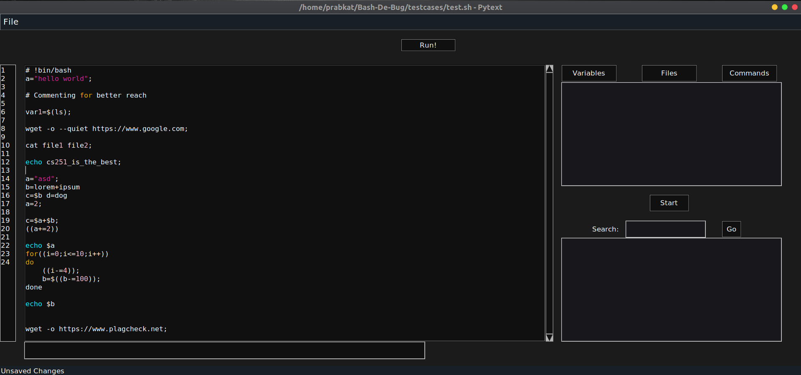
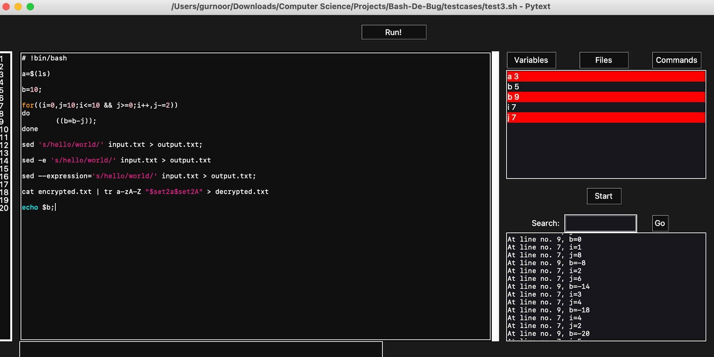

@mainpage

# Bash-De-Bug
Course Project of CS251, Autumn 2020.

The aim of this project is to build a debugger, primarily intended for Bash Scripts, that prints out the variables and the contents of files that are being used in the program. Although the way this is being built, it wont be hard to extend it to other languages as well.

## Approach
The project is overall divided into two parts - one is the front-end part where we build a Tkinter based GUI for the project, and another is the backend part, where we manage writing a parser for Bash scripts, detecting variable assignments in it, and inserting the print statements in a copy of the script. Then we execute the script from within python, and redirect the output to the user, filtering the line numbers / variable names requested.

Initially, we planned to just do a string search for the file, detect `=` signs for assignment operations, check for a few more conditions and conclude that the variable is detected. But this approach did not seem elegant or challenging, it seemed just like a workaround. So we decided to go with parsing.

### GUI
* The front-end of the project has been designed with the help of ``tkinter`` module in python. 
* The Main window is divided into three sections:
    - Bash IDE region
    - Debugger region
    - Variables list region
* The Bash IDE is an attempt to take as input the code provided by the user, as well as function as an independent code editor. The following features have been added to imitate any generic IDE:
    - Editing shortcuts like cut (Control-c) and paste (Control-v)
    - Find and Replace option for easy editing
    - Line number class to implement dynamic line numbering and scroll features
    - Syntax highlighting of Bash keywords, numbers and strings for a smoother coding experience

This is an example of how the IDE region should look (in Dark Mode!!)

### Parsing
* The first thing we looked for parsing was a library named [bashlex](https://github.com/idank/bashlex). But this had a lot of issues and did not turn out well.
* So we resorted to making a custom parser and lexer using [ANTLR4](https://github.com/antlr/antlr4).
* The first step was to create a grammar file, which contained the parser and lexer rules.
* The lexer tokenises the whole input file. The rules for tokens are defined uisng regular expressions, in the grammar file. Also, extreme care had to be taken in the order of tokens, the ones defined first are given higher preference. Moreover, the lexer tries to generate the least number of tokens possible.
* The parser rules use the tokens generated above, to recognise the various structures such as for/while loops, if/else statements and assignment operations.
* After writing rules in grammar, we generate the parser in Python. It basically gives us a tree structure of the whole program, by doing a depth first search in it. There are various entry and exit functions available, which we use to gain relevant information.

## What It CAN do
* We type a bash script, or choose a file from our PC and the program detects all the variables in the script and displays them on the GUI.
* The user is asked to select the variables, and/or the line numbers between which he wants to view the variables.
* The required output is shown on the output box, and we have a substring matching feature through which the user can even search for the required variable and line number.
* It can go through for/while loops, and assignment operations. It can also handle basic bash commands like `wget`, `ls`, `cat`, `cut`, etc. 

## What it CANNOT do
* It cannot check for the correctness of the syntax. The bash syntax is quite diverse and writing a rule for each of them with proper arguments and flags would get quite difficult.
* It assumes that the syntax is correct, and hence helps to fix the **logical errors**.

## Phase 2 improvements
* Added support for sed scripts
* Parsed function calls
* Made linux commands more descriptive by showing the options with which they are called.
* Improvements in Grammar
* Design improvements including separate lists for variables, files, and commands.
* Added search functionality using string similarity algorithms

## Example
For the following input,

    # !bin/bash

    a=$(ls)

    b=10;

    for((i=0,j=10;i<=10 && j>=0;i++,j-=2))
    do
        ((b=b-j));
    done

    sed 's/hello/world/' input.txt > output.txt;

    sed -e 's/hello/world/' input.txt > output.txt

    sed --expression='s/hello/world/' input.txt > output.txt;

    cat encrypted.txt | tr a-zA-Z "$set2a$set2A" > decrypted.txt

    echo $b;

the abstract syntax tree that we get is  

and the corresponding tokens generated are  

    [@58,89:91='sed',<'sed'>,12:0]
    [@59,92:92=' ',<SPACE>,12:3]
    [@60,93:108=''s/hello/world/'',<SINGLE_STRING>,12:4]
    [@61,109:109=' ',<SPACE>,12:20]
    [@62,110:118='input.txt',<FILENAME>,12:21]
    [@63,119:119=' ',<SPACE>,12:30]
    [@64,120:120='>',<COMPARE>,12:31]
    [@65,121:121=' ',<SPACE>,12:32]
    [@66,122:131='output.txt',<FILENAME>,12:33]
    [@67,132:132=';',<';'>,12:43]
    [@68,133:133='\n',<SPACE>,12:44]
    [@69,134:134='\n',<SPACE>,13:0]
    [@70,135:137='sed',<'sed'>,14:0]
    [@71,138:138=' ',<SPACE>,14:3]
    [@72,139:140='-e',<SINGLE_TAG>,14:4]
    [@73,141:141=' ',<SPACE>,14:6]
    [@74,142:157=''s/hello/world/'',<SINGLE_STRING>,14:7]
    [@75,158:158=' ',<SPACE>,14:23]
    [@76,159:167='input.txt',<FILENAME>,14:24]
    [@77,168:168=' ',<SPACE>,14:33]
    [@78,169:169='>',<COMPARE>,14:34]
    [@79,170:170=' ',<SPACE>,14:35]
    [@80,171:180='output.txt',<FILENAME>,14:36]
    [@81,181:181='\n',<SPACE>,14:46]
    [@82,182:182='\n',<SPACE>,15:0]
    [@83,183:185='sed',<'sed'>,16:0]
    [@84,186:186=' ',<SPACE>,16:3]
    [@85,187:199='--expression=',<FULL_TAG>,16:4]
    [@86,200:215=''s/hello/world/'',<SINGLE_STRING>,16:17]
    [@87,216:216=' ',<SPACE>,16:33]
    [@88,217:225='input.txt',<FILENAME>,16:34]
    [@89,226:226=' ',<SPACE>,16:43]
    [@90,227:227='>',<COMPARE>,16:44]
    [@91,228:228=' ',<SPACE>,16:45]
    [@92,229:238='output.txt',<FILENAME>,16:46]
    [@93,239:239=';',<';'>,16:56]
    [@94,240:240='\n',<SPACE>,16:57]
    [@95,241:241='\n',<SPACE>,17:0]
    [@96,242:244='cat',<COMMAND>,18:0]
    [@97,245:245=' ',<SPACE>,18:3]
    [@98,246:258='encrypted.txt',<FILENAME>,18:4]
    [@99,259:259=' ',<SPACE>,18:17]
    [@100,260:260='|',<'|'>,18:18]
    [@101,261:261=' ',<SPACE>,18:19]
    [@102,262:263='tr',<COMMAND>,18:20]
    [@103,264:264=' ',<SPACE>,18:22]
    [@104,265:270='a-zA-Z',<VAR>,18:23]
    [@105,271:271=' ',<SPACE>,18:29]
    [@106,272:285='"$set2a$set2A"',<DOUBLE_STRING>,18:30]
    [@107,286:286=' ',<SPACE>,18:44]
    [@108,287:287='>',<COMPARE>,18:45]
    [@109,288:288=' ',<SPACE>,18:46]
    [@110,289:301='decrypted.txt',<FILENAME>,18:47]
    [@111,302:302='\n',<SPACE>,18:60]
    [@112,303:303='\n',<SPACE>,19:0]
    [@113,304:307='echo',<COMMAND>,20:0]
    [@114,308:308=' ',<SPACE>,20:4]
    [@115,309:310='$b',<BASH_VAR>,20:5]
    [@116,311:311=';',<';'>,20:7]
    [@117,312:311='<EOF>',<EOF>,20:8]
    
 
The GUI generated using Tkinter, giving an idea of what we hope to accomplish 
<!--   -->

